# Lab 8 - Neo4j Graph

Proyecto de laboratorio para modelar y crear un grafo en Neo4j usando Python.

Integrantes:
- Vianka Castro
- Felipe Aguilar
- Esteban Carcamo
- Ricardo Godinez

Link al repo: https://github.com/ecarcamo/lab8-BD 

## Objetivo

Implementar una conexión a Neo4j y crear funciones para:

- crear nodos
- crear relaciones
- evitar duplicados usando `MERGE`
- probar el flujo con datos de ejemplo
- validar comportamiento con tests unitarios

## Tecnologías usadas

- Python
- Neo4j Aura
- `neo4j` driver
- `python-dotenv`
- `unittest`

## Variables de entorno

El proyecto usa un archivo `.env` con estas variables:

```env
NEO4J_URI=
NEO4J_USERNAME=
NEO4J_PASSWORD=
NEO4J_DATABASE=
```

## Estructura actual

```text
lab8/
├── main.py
├── requirements.txt
├── README.md
├── output/
│   └── screenshot-2026-04-08_00-57-40.png
└── tests/
    ├── __init__.py
    ├── test_funciones_nodos.py
    ├── test_funciones_relaciones.py
    ├── test_main.py
    └── utils.py
```

## Funcionalidad implementada

### 1. Conexión a Neo4j

En [main.py](/home/escu/Documents/Universidad/Semestres/7moSemestre/databases2/lab8/main.py) se implementó la clase `Neo4jManager`, que:

- carga variables desde `.env`
- crea el `driver`
- abre sesiones usando `NEO4J_DATABASE`
- ejecuta una query de prueba
- cierra sesión y driver correctamente

### 2. Creación de nodos

Se implementaron funciones para crear estos nodos:

- `create_user(name, user_id)`
- `create_movie(title, movie_id, year, imdb_id, **extra_properties)`
- `create_genre(name)`
- `create_person(name, tmdb_id, born=None, **extra_properties)`

Cada una usa `MERGE` para evitar nodos duplicados.

### 3. Creación de relaciones

Se implementaron funciones para crear estas relaciones:

- `create_rated_relationship(user_id, movie_id, rating, timestamp)`
- `create_acted_in_relationship(person_id, movie_id, role)`
- `create_directed_relationship(person_id, movie_id)`
- `create_in_genre_relationship(movie_id, genre_name)`

Antes de crear una relación, el código valida que los nodos necesarios existan.

### 4. Flujo funcional en `main()`

El `main()` actualmente realiza este flujo:

1. conecta a Neo4j
2. ejecuta una query de prueba
3. crea nodos de ejemplo
4. crea relaciones de ejemplo
5. cierra la conexión

Datos usados en la prueba funcional:

- `user_id = "1"`
- `movie_id = "100"`
- `genre = "Action"`
- `person_id = "200"`

## Resultado visual del grafo

La siguiente imagen muestra el resultado creado en Neo4j Browser:

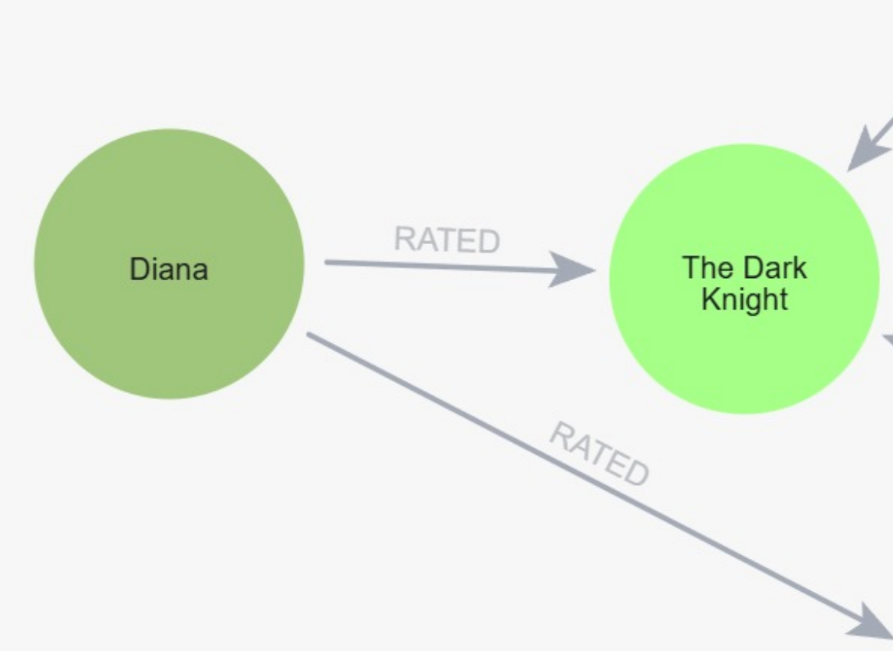

## Insertar 5 usuarios con al menos 2 ratings

### En el archivo [populate.py](populate.py) se implementó la función `poblar_usuarios_y_ratings` que inserta 5 usuarios con al menos 2 ratings cada uno.

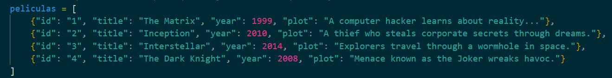

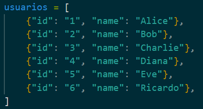

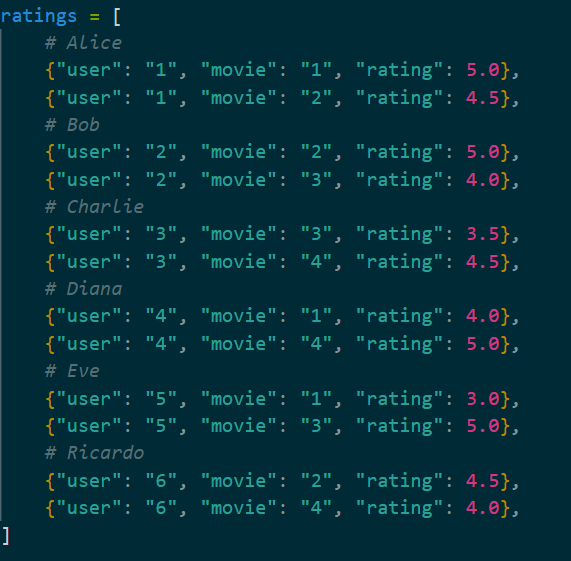

### Vizualizado en AuraDB:

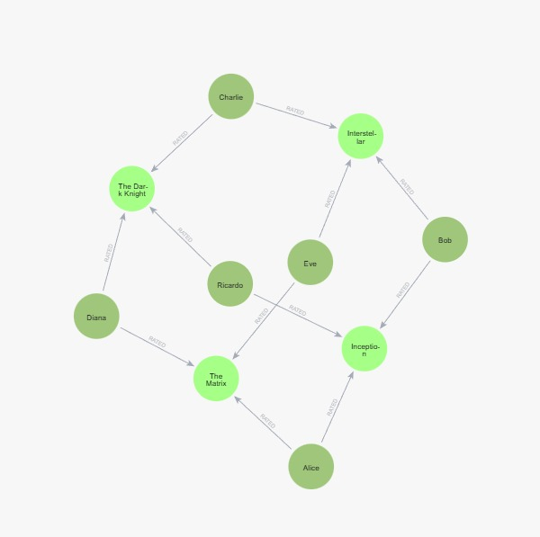

## 3. Implementar una función para encontrar un usuario, una película y un usuario con su relación rate a película. Deberá evidenciar el funcionamiento de dicha función.

### Se implementarion las funciones para buscar usuarios, peliculas y relaciones en el archivo [search.py](search.py)

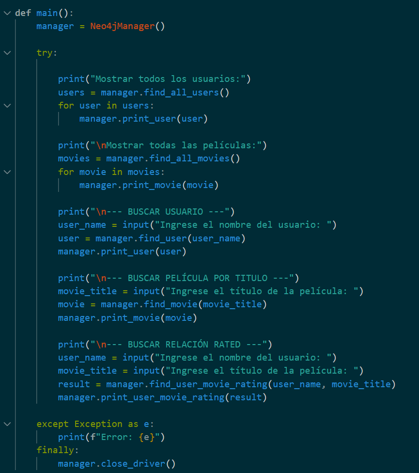

### Este es el resultado obtenido

### Resultado de buscar todos los usuarios en el programa

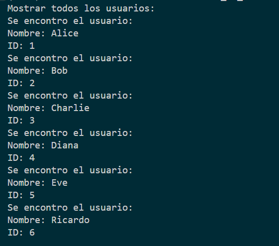

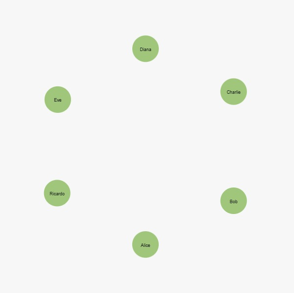


### Resultado de buscar todas las peliculas en el programa

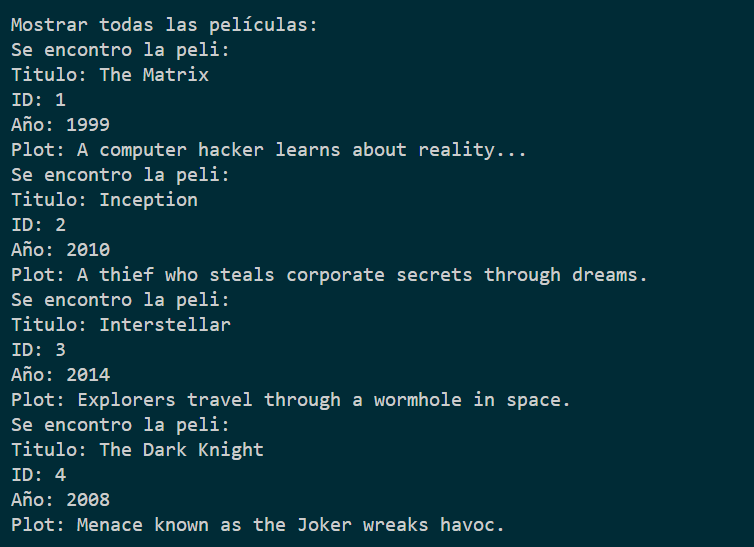

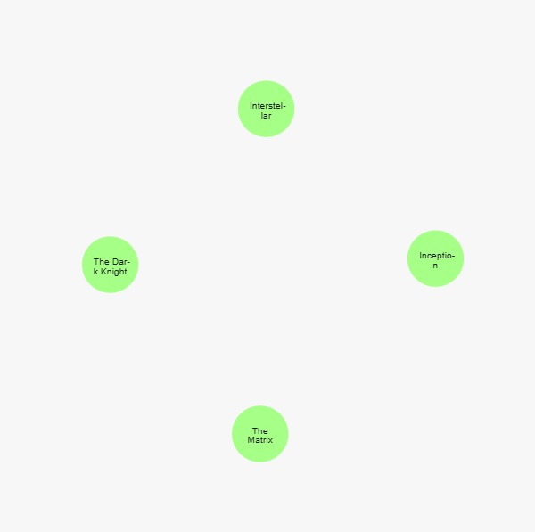


### Resultado de buscar un usuario en el programa

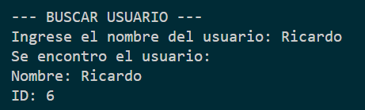


### Resultado de buscar una pelicula en el programa

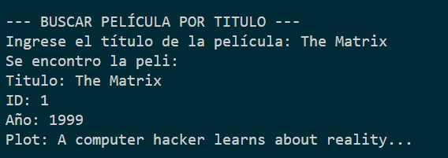


### Resultado de buscar una relacion en el programa

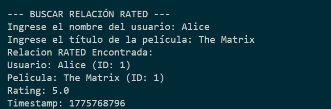


## Ahora, con las funciones previamente creadas, deberá generar el siguiente grafo. Es importante que tome en cuenta todas las propiedades de cada label y de aquellas relaciones que tengan alguna:

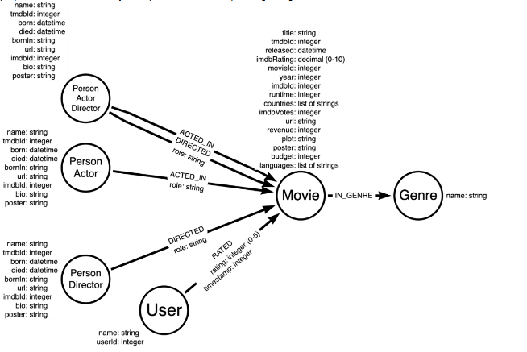

### Para esto creamos una nueva instancia de aura que no interfiera con la anterior.

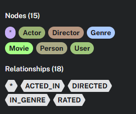

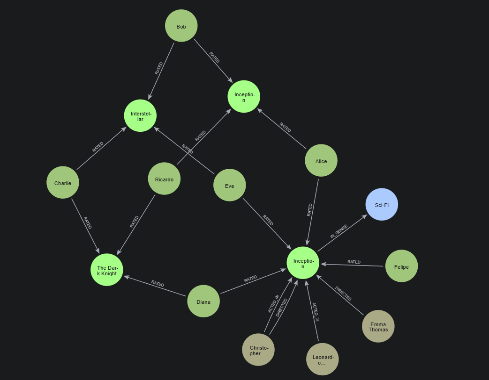

### Usamos el archivo [populate_graph.py](populate_graph.py) para crear el grafo nuevo usando las funciones previamente creadas en el archivo [main.py](main.py).

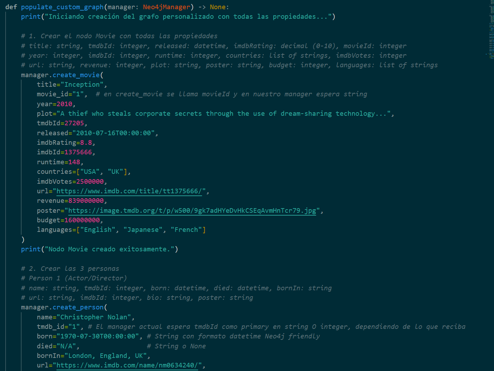

## Cómo ejecutar el proyecto

1. Crear y activar el entorno virtual.
2. Instalar dependencias.
3. Configurar el archivo `.env`.
4. Ejecutar el programa.

```bash
pip install -r requirements.txt
python main.py
```

## Cómo ejecutar los tests

```bash
python -m unittest
```

Estado actual de pruebas:

- `15 tests` pasando correctamente

## Grafo modelado hasta ahora

### Nodos

- `User`
- `Movie`
- `Genre`
- `Person`

### Relaciones

- `RATED`
- `ACTED_IN`
- `DIRECTED`
- `IN_GENRE`

## Estado actual del laboratorio

Hasta este punto ya se completó:

- conexión a Neo4j
- creación de nodos
- creación de relaciones
- prueba funcional básica
- tests unitarios de conexión, nodos, relaciones y flujo principal

El siguiente paso natural sería cargar más datos o automatizar inserciones desde archivos/datasets.
